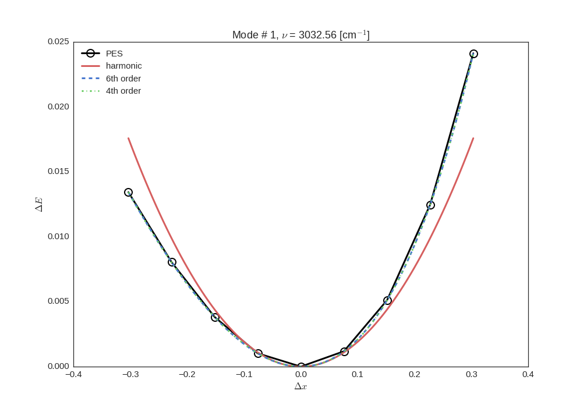

Tutorials
=========

Harmonic and Anharmonic Thermochemistry
---------------------------------------

This tutorial explains step by step how to use the panther_ package to
calculate the thermodynamic functions of molecules and solids making use
of the standard harmonic vibrational analysis and anharmonic vibrations
in the independent mode approximation as explained in detail in references
[1]_, [2]_, [3]_.

For each step some of the data will be explicitly printed to illustrate the
underlying data structures, however in production runs such level of verbosity
is not necessary.

The methanol molecule will be used as and example and VASP_ code will be used
to perform the calculations, however since panther_ is interfaced with ASE_
any of the supported calculators_ can be used instead with appropriate
modifications.

Structure relaxation
~~~~~~~~~~~~~~~~~~~~

First of all the molecule needs to be relaxed and it is recommended to
converge the forces below 1.0e-5 eV/A. Here the initial structure is
read from the ``methanol.xyz`` file and the structure relaxation is performed using
the LBFGS_ method implemented in ASE_ instead of the internal VASP_ optimizers.

.. code-block:: python

   import ase.io
   from ase.calculators.vasp import Vasp
   from ase.optimizers import LBFGS

   meoh = ase.io.read('methanol.xyz')

   calc = Vasp(
           prec='Accurate',
           gga='PE',
           lreal=False,
           ediff=1.0e-8,
           encut=600.0,
           nelmin=5,
           nsw=1,
           nelm=100,
           ediffg=-0.001,
           ismear=0,
           ibrion=-1,
           nfree=2,
           isym=0,
           lvdw=True,
           lcharg=False,
           lwave=False,
           istart=0,
           npar=2,
           ialgo=48,
           lplane=True,
           ispin=1,
   )

   meoh.set_calculator(calc)

   optimizer = LBFGS(meoh, trajectory='relaxed.traj',
                     restart='lbfgs.pkl', logfile='optimizer.log')

   optimizer.run(fmax=0.00001)

Hessian matrix
~~~~~~~~~~~~~~

Having optimized the structure we will also need the `hessian matrix`_.
We will use internal VASP_ mode (`IBRION=5`) to generate the hessian
using cartesian coordinate displacements, therefore we need to update the calculator's
parameters. After the hessian is calculated it is read from the OUTCAR_
symmetrized, converted to `atomic units`_ and saved as a `numpy array`_
for convenience

.. code-block:: python

   from panther.inputreader import read_vasp_hessian

   # adjust the calcualtor argument for hessian calculation 
   calc.set(ibrion=5, potim=0.02)

   calc.calculate(meoh)
   
   hessian = read_vasp_hessian('OUTCAR', symmetrize=True, convert2au=True, negative=True)
   np.save('hessian', hessian)

Harmonic vibrations and thermochemistry
----------------------------------------

We can now use the hessian to calculate thermochemical functions in the
harmonic oscillator approximation, starting by calcualting the
frequencies and normal modes

.. code-block:: python

   from panther.vibrations import harmonic_vibrational_analysis

   frequencies, normal_modes = harmonic_vibrational_analysis(hessian, meoh,
               proj_translations=True, proj_rotations=True, ascomplex=False)

The resulting frequencies are in `atomic units`_ and need to be
converted to Joules and passed to
:py:class:`Thermochemistry <panther.thermochemistry.Thermochemistry>` to
calculate thermochemical functions

.. code-block:: python

   from scipy.constants import value, Planck
   from panther.thermochemistry import Thermochemistry

   vibenergies = Planck * frequencies.real * value('hartree-hertz relationship')
   vibenergies = vibenergies[vibenergies > 0.0]

   thermo = Thermochemistry(vibenergies, meoh, phase='gas', pointgroup='Cs')
   thermo.summary(T=273.15, p=0.1)

.. code-block:: bash

   ================ THERMOCHEMISTRY =================
   
      @ T = 273.15 K  p =   0.10 MPa
   
   --------------------------------------------------
   Partition functions:
   ln q                     :          23.802
       ln q_translational   :          15.574
       ln q_rotational      :           7.949
       ln q_vibrational     :           0.280
   --------------------------------------------------
   Enthalpy (H)             :         140.014  kJ/mol
       H translational      :           3.407  kJ/mol
       H rotational         :           3.407  kJ/mol
       H vibrational        :         130.930  kJ/mol
           @ 0 K (ZPVE)     :         129.733  kJ/mol
           @ 273.15 K       :           1.197  kJ/mol
           pV               :           2.271  kJ/mol
   --------------------------------------------------------------------------
                                                                  *T
   Entropy (S)              :           0.2355 kJ/mol*K        64.3395 kJ/mol
       S translational      :           0.1503 kJ/mol*K        41.0476 kJ/mol
       S rotational         :           0.0786 kJ/mol*K        21.4591 kJ/mol
       S vibrational        :           0.0067 kJ/mol*K         1.8328 kJ/mol
   --------------------------------------------------------------------------
   U - T*S                  :          75.6749 kJ/mol
   --------------------------------------------------
   Electronic energy        :       -2918.9516 kJ/mol

Anharmonic Thermochemistry
--------------------------

Internal coordinate displacements
~~~~~~~~~~~~~~~~~~~~~~~~~~~~~~~~~

With frequencies and normal modes we can further generate a
grid of displacements along each normal mode using internal coordinates to
improve the sampling of the potential energy surface. This is done using the
:py:func:`calculate_displacements <panther.displacements.calculate_displacements>`
function. The function returns a nested :py:class:`OrderedDict <collections.OrderedDict>`
of structures as `ase.Atoms`_ objects with mode number and displacement sample number as keys.
For example if ``npoints=4`` is given as an argument there will be 8 structures
per mode labeled with numbers 1, 2, 3, 4, -1, -2, -3, -4 signifying the direction
and the magnitude of the displacement. 

.. code-block:: python

   from panther.displacements import calculate_displacements

   images, modeinfo = calculate_displacements(meoh, hessian, frequencies, normal_modes, npoints=4)

   print(modeinfo.to_string())

              HOfreq  effective_mass displacement is_stretch vibration     P_stretch        P_bend     P_torsion  P_longrange
   mode                                                                                                                      
   0     3748.362703     1944.298846      3.05268       True      True  1.000538e+00  9.633947e-07  3.581071e-08          0.0
   1     3033.988514     2003.111476      3.39309       True      True  1.000487e+00  1.444002e-03  1.358614e-08          0.0
   2     2956.839029     2015.939983      3.43707       True      True  1.000163e+00  2.112104e-03  0.000000e+00          0.0
   3     2897.901987     1886.235715      3.47185       True      True  1.002597e+00  4.553844e-05  0.000000e+00          0.0
   4     1445.646111     1896.588719      2.45777      False      True  2.423247e-04  8.382427e-01  1.620089e-01          0.0
   5     1430.743791     1910.050531      2.47054      False      True  5.828069e-07  7.696362e-01  2.314594e-01          0.0
   6     1413.372913     2064.662087      2.48567      False      True  1.101886e-05  1.013066e+00  1.246737e-02          0.0
   7     1320.779390     2344.971044      2.57133      False      True  2.648486e-03  8.819130e-01  1.163030e-01          0.0
   8     1122.078049     2310.188376      2.78972      False      True  8.856000e-04  8.562025e-01  1.423684e-01          0.0
   9     1043.856152     2998.235955      2.89236      False      True  4.590826e-01  4.698373e-01  7.957428e-02          0.0
   10     999.428001     4154.928137      2.95595      False      True  5.647864e-01  3.944914e-01  4.924659e-02          0.0
   11     276.606858     1950.430919      5.61876      False      True  5.101834e-06  1.465507e-04  1.002540e+00          0.0
   12       0.000000     8792.819312          inf      False     False           NaN           inf           NaN          0.0
   13       0.000000     4750.377947          inf       True     False           inf           NaN           NaN          0.0
   14       0.000000     6312.514911          inf       True     False           inf           NaN           NaN          0.0
   15       0.000000     5243.620927          inf       True     False           inf           NaN           NaN          0.0
   16       0.000000     2177.259022          inf      False     False           NaN           inf           NaN          0.0
   17       0.000000     8532.108968          inf       True     False           inf           NaN           NaN          0.0

The function also returns ``modeinfo`` DataFrame_ with additional characteristics
of the mode such as ``displacement``, ``is_stretch`` and ``effective_mass`` and
components of the vibrational population analysis.

Calculating energies for the displaced structures
~~~~~~~~~~~~~~~~~~~~~~~~~~~~~~~~~~~~~~~~~~~~~~~~~

Per each displaced structure we can calculate the energy, in this example
using the VASP_ calculator again in the single point calculation mode

.. code-block:: python

   from panther.pes import calculate_energies

   # set the calculator in single point mode
   calc.set(ibrion=-1)

   energies = calculate_energies(images, calc, modes='all')

This will return a DataFrame_ with ``npoints * 2`` energies per mode.

The ``energies`` are missing the equilibrium structure energy which can be
easily set through

.. code-block:: python

   energies['E_0'] = meoh.get_potential_energy()

   print(energies.to_string())

            E_-4       E_-3       E_-2       E_-1        E_0        E_1        E_2        E_3        E_4
   0  -29.838210 -29.999174 -30.129845 -30.219158 -30.252801 -30.212111 -30.072575 -29.801815 -29.357050
   1  -29.887274 -30.033740 -30.148793 -30.224943 -30.252801 -30.220603 -30.113614 -29.913317 -29.596341
   2  -29.765209 -29.983697 -30.134831 -30.223555 -30.252801 -30.223573 -30.135003 -29.984312 -29.766713
   3  -29.880739 -30.032824 -30.149891 -30.225671 -30.252801 -30.222657 -30.125177 -29.948635 -29.679366
   4  -30.194580 -30.220226 -30.238397 -30.249217 -30.252801 -30.249248 -30.238656 -30.221115 -30.196709
   5  -30.196107 -30.220941 -30.238652 -30.249266 -30.252801 -30.249268 -30.238667 -30.220985 -30.196211
   6  -30.199391 -30.222460 -30.239171 -30.249354 -30.252801 -30.249264 -30.238446 -30.219995 -30.193484
   7  -30.202508 -30.224242 -30.239987 -30.249567 -30.252801 -30.249516 -30.239548 -30.222731 -30.198903
   8  -30.208386 -30.227840 -30.241715 -30.250030 -30.252801 -30.250030 -30.241714 -30.227847 -30.208412
   9  -30.209316 -30.228681 -30.242227 -30.250194 -30.252801 -30.250259 -30.242766 -30.230511 -30.213676
   10 -30.210619 -30.229477 -30.242607 -30.250294 -30.252801 -30.250378 -30.243261 -30.231673 -30.215822
   11 -30.241961 -30.246534 -30.249960 -30.252081 -30.252801 -30.252072 -30.249935 -30.246486 -30.241889

Calculating the frequencies
~~~~~~~~~~~~~~~~~~~~~~~~~~~

Frequencies can now be calculated using the finite difference method implemented in
:py:func:`panther.pes.differentiate` function and appended as a ``frequency`` column
to the ``modeinfo``. The returned ``vibs`` matrix contains four columns corresponding
to derivatives calculated with the central formula using 2, 4, 6 and 8 points 

.. code-block:: python

   from panther.pes import differentiate
   from scipy.constants import value

   dsp = modeinfo.loc[modeinfo['vibration'], 'displacement'].astype(float).values
   vibs = differentiate(dsp, energies, order=2)

   au2invcm = 0.01 * value('hartree-inverse meter relationship')
   np.sqrt(vibs) * au2invcm

   array([[ 3757.6949986 ,  3745.36173164,  3745.5117494 ,  3745.51978786],
          [ 3038.75202112,  3032.49074659,  3032.55620542,  3032.56159197],
          [ 2960.0679129 ,  2956.11388526,  2956.13869496,  2956.14205087],
          [ 2900.20373811,  2897.17093192,  2897.18620368,  2897.18888617],
          [ 1446.18374932,  1446.16517443,  1446.1824322 ,  1446.19041632],
          [ 1431.77027217,  1431.68206976,  1431.68116942,  1431.68294377],
          [ 1414.58204596,  1414.17987052,  1414.182009  ,  1414.18039006],
          [ 1321.14267911,  1321.22424463,  1321.24026442,  1321.2470148 ],
          [ 1122.70558461,  1122.64210276,  1122.63752157,  1122.63384929],
          [ 1043.87393741,  1043.78448965,  1043.78296923,  1043.78025961],
          [  999.41759187,   999.30803727,   999.31024481,   999.30971807],
          [  285.06040099,   285.79248818,   285.87505212,   285.9193547 ]])

   # assign the frequencies fitted with 8 points to a frequency column
   # in the modeinfo
   modeinfo.loc[modeinfo['vibration'], 'frequency'] = (np.sqrt(vibs)*au2invcm)[:, 3]

Fitting the potentials
~~~~~~~~~~~~~~~~~~~~~~

The last this is to fit the potential energy surfaces as 6th and 4th order polynomials

.. code-block:: python

   from panther.pes import fit_potentials

   # fit the potentials on 6th and 4th order polynomials
   c6o, c4o = fit_potentials(mi, energies)

The two DataFrame_ objects ``c6o`` and ``c4o`` contain fitted polynomial coefficients for each
mode. We can use the energies and the polynomial coefficients to plot the PES and the fitted
potentials, here as an example, second mode (`mode=1` since the modes are indexed from 0) is
plotted  

.. code-block:: python

   from panther.plotting import plotmode

   plotmode(1, energies, modeinfo, c6o, c4o)

Anharmonic frequencies from 1-D Schrodinger Equation
----------------------------------------------------

Anharmonic frequencies are calculated first by solving the 1-D Schrodinger
equation per mode as exaplained in reference [4]_ and then those frequencies
are used to calculate the thermodynamic functions 

.. code-block:: python

   from panther.anharmonicity import anharmonic_frequencies, harmonic_df, merge_vibs
   from panther.thermochemistry import AnharmonicThermo

   anh6o = anharmonic_frequencies(meoh, 273.15, c6o, modeinfo)
   anh4o = anharmonic_frequencies(meoh, 273.15, c4o, modeinfo)

   harmonicdf = harmonic_df(modeinfo, 273.15)
   finaldf = merge_vibs(df6, df4, hdf, verbose=False)

   at = AnharmonicThermo(fdf, meoh, phase='gas', pointgroup='Cs')
   at.summary(T=273.15, p=0.1)

.. code-block:: bash

   ================ THERMOCHEMISTRY =================

     @ T = 273.15 K  p =   0.10 MPa

   --------------------------------------------------
   Partition functions:
   ln q                     :          23.667
       ln qtranslational    :          15.574
       ln qrotational       :           7.949
       ln qvibrational      :           0.145
   --------------------------------------------------
   Enthalpy (H)             :         138.890  kJ/mol
       H translational      :           3.407  kJ/mol
       H rotational         :           3.407  kJ/mol
       H vibrational        :         129.806  kJ/mol
           @ 0 K (ZPVE)     :         129.675  kJ/mol
           @ 273.15 K       :           0.131  kJ/mol
           pV               :           2.271  kJ/mol
   --------------------------------------------------------------------------
                                                                  *T
   Entropy (S)              :           0.2375 kJ/mol*K        64.8694 kJ/mol
       S translational      :           0.1503 kJ/mol*K        41.0476 kJ/mol
       S rotational         :           0.0786 kJ/mol*K        21.4591 kJ/mol
       S vibrational        :           0.0086 kJ/mol*K         2.3627 kJ/mol
   --------------------------------------------------------------------------
   H - T*S                  :          74.0209 kJ/mol
   --------------------------------------------------
   Electronic energy        :       -2918.9516 kJ/mol

.. _ase.Atoms: https://wiki.fysik.dtu.dk/ase/ase/atoms.html
.. _ASE: hhttps://wiki.fysik.dtu.dk/ase/index.html
.. _atomic units: https://en.wikipedia.org/wiki/Atomic_units
.. _calculators: https://wiki.fysik.dtu.dk/ase/ase/calculators/calculators.html
.. _DataFrame: http://pandas.pydata.org/pandas-docs/stable/generated/pandas.DataFrame.html
.. _hessian matrix: https://en.wikipedia.org/wiki/Hessian_matrix
.. _LBFGS: https://en.wikipedia.org/wiki/Limited-memory_BFGS
.. _numpy array: http://docs.scipy.org/doc/numpy-1.10.0/reference/generated/numpy.array.html
.. _OUTCAR: http://cms.mpi.univie.ac.at/vasp/guide/node50.html#SECTION00070000000000000000
.. _panther: http://panther.rtfd.io
.. _trajectory: https://wiki.fysik.dtu.dk/ase/ase/io/trajectory.html
.. _VASP: https://www.vasp.at/

.. [1] Piccini, G., Alessio, M., Sauer, J., Zhi, Y., Liu, Y., Kolvenbach, R.,
   Jentys, A., Lercher, J. A. (2015). Accurate Adsorption Thermodynamics of
   Small Alkanes in Zeolites. Ab initio Theory and Experiment for H-Chabazite.
   The Journal of Physical Chemistry C, 119(11), 6128–6137.
   `doi:10.1021/acs.jpcc.5b01739 <https://dx.doi.org/10.1021/acs.jpcc.5b01739>`_
.. [2] Piccini, G., & Sauer, J. (2014). Effect of anharmonicity on adsorption
   thermodynamics. Journal of Chemical Theory and Computation, 10, 2479–2487.
   `doi:10.1021/ct500291x <https://dx.doi.org/10.1021/ct500291x>`_
.. [3] Piccini, G., & Sauer, J. (2013). Quantum Chemical Free Energies:
   Structure Optimization and Vibrational Frequencies in Normal Modes.
   Journal of Chemical Theory and Computation, 9(11), 5038–5045.
   `doi:10.1021/ct4005504 <https://dx.doi.org/10.1021/ct4005504>`_
.. [4] Beste, A. (2010). One-dimensional anharmonic oscillator: Quantum versus
   classical vibrational partition functions. Chemical Physics Letters,
   493(1-3), 200–205.
   `doi:10.1016/j.cplett.2010.05.036 <https://dx.doi.org/10.1016/j.cplett.2010.05.036>`_
