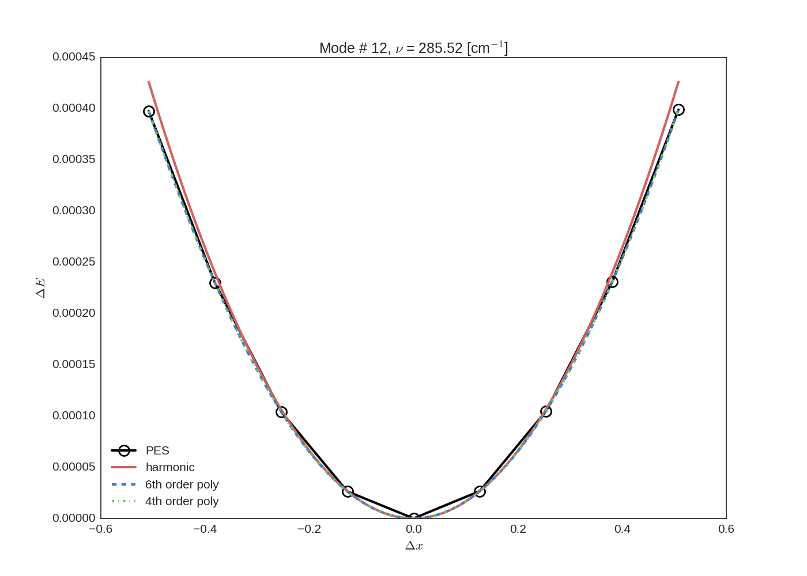
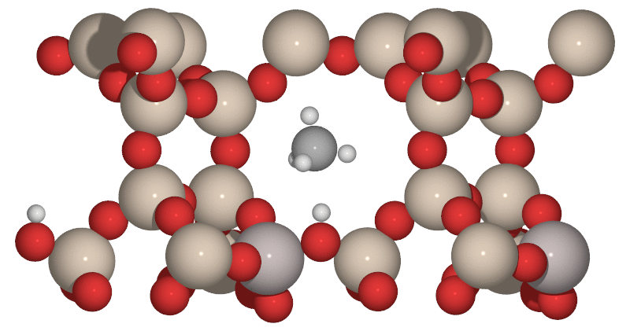

User guide
==========

Available CLI programs:

    - :ref:`panthera-label` format conversion, calculation of harmonic and anharmonic frequencies
    - :ref:`plotmode-label` visualiztion of vibrational potential per mode
    - :ref:`writemodes-label` conversion of geometry files to collections of modes

.. _panthera-label:

panthera
-------

The panthera script takes two command line argument

.. code-block:: bash

   $ panthera

   usage: panthera [-h] {convert,harmonic,anharmonic} config

   positional arguments:
     {convert,harmonic,anharmonic}
                           choose what to do
     config                file with the configuration parameters for thermo

   optional arguments:
     -h, --help            show this help message and exit

The input file is in the standard condif file format and contains three sections
``conditions``, ``job`` and ``system`` defining the parameters.

conditions
^^^^^^^^^^

    pressure : float
        Pressure in MPa
    Tinitial : float
        Smallest Temperature in K
    Tfinal : float
        Largest temperatue in K
    Tstep : float
        Temperature step for temperature grid (in K)

.. code-block:: python

   [conditions]
   Tinitial = 303.15
   Tfinal = 403.15
   Tstep = 10.0
   pressure = 0.1

job
^^^

    translations : bool
        If True the translational degrees of freedom will be projected out from the hessian
    rotations : bool
        If True the translational degrees of freedom will be projected out from the hessian
    code : str
        Program to use for single point calcualtions

.. code-block:: python

   [job]
   translations = true
   rotations = false
   code = vasp

system
^^^^^^

    pointgroup : str
        Point group symbol of the system
    phase : str
        Phase of the system, either ``gas`` or ``solid``

.. code-block:: python

   [system]
   pointgroup = Dooh
   phase = gas

.. _plotmode-label:

plotmode
--------

.. code-block:: bash

   $ plotmode -h

   usage: plotmode [-h] [-s SIXTH] [-f FOURTH] [-p PES] [-o OUTPUT] mode
   
   positional arguments:
     mode                  number of the mode to be printed
   
   optional arguments:
     -h, --help            show this help message and exit
     -s SIXTH, --sixth SIXTH
                           file with sixth order polynomial fit,
                           default="em_freq"
     -f FOURTH, --fourth FOURTH
                           file with fourth order polynomial fit,
                           default="em_freq_4th"
     -p PES, --pes PES     file with the potential energy surface (PES),
                           default="test_anharm"
     -o OUTPUT, --output OUTPUT
                           name of the output file

Example
^^^^^^^

Provided that the default files ``em_freq``, ``em_freq_4th`` and ``test_anharm`` are present
to plot the last mode only requires the argument ``12``

.. code-block:: bash

   plotmode 12

.. _writemodes-label:

writemodes
----------

This program takes the single file with continuous geometries in `VASP POSCAR <http://cms.mpi.univie.ac.at/vasp/guide/node59.html>`_
format as input and writes separate file in ASE trajectory format per node to a specified directory.

.. code-block:: bash

   $ writemodes -h

   usage: writemodes [-h] [-d DIR] filename

   positional arguments:
     filename           name of the file with geometries, default="POSCARs"

   optional arguments:
     -h, --help         show this help message and exit
     -d DIR, --dir DIR  directory to put the modes, default="modes"

Example
^^^^^^^

Provided that the ``POSCARs`` file exists we can generate trajectory_ files with the modes with:

.. code-block:: bash

    writemodes POSCARs

which produces the ``mode.X.traj`` files in the ``modes`` directory where ``X`` is the mode number.

We can now generate a set of PNG_ files representing the snapshots of the mode by:

.. code-block:: python

   from ase.io import read, write
   modes = read('mode.1.traj', index=':')

   for i, mode in enumerate(modes):
       write('{0:0>3d}.pov'.format(i), mode, run_povray=True, rotation='90x', canvas_width=800)

To see the animation we can create an GIF_ file from the previosly generated PNG_ files using
the ``convert`` program from the ImageMagick_ package:

.. code-block:: bash

   convert -delay 15 -loop 0 *.png mode1-animation.gif

.. _trajectory: https://wiki.fysik.dtu.dk/ase/ase/trajectory.html
.. _PNG: https://en.wikipedia.org/wiki/Portable_Network_Graphics
.. _GIF: https://en.wikipedia.org/wiki/GIF
.. _ImageMagick: http://www.imagemagick.org/script/index.php